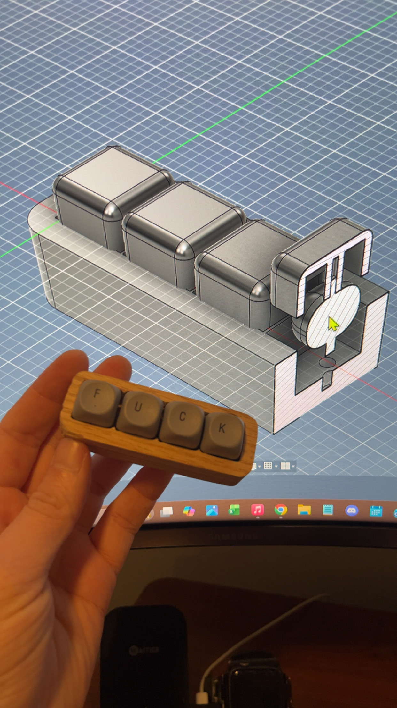
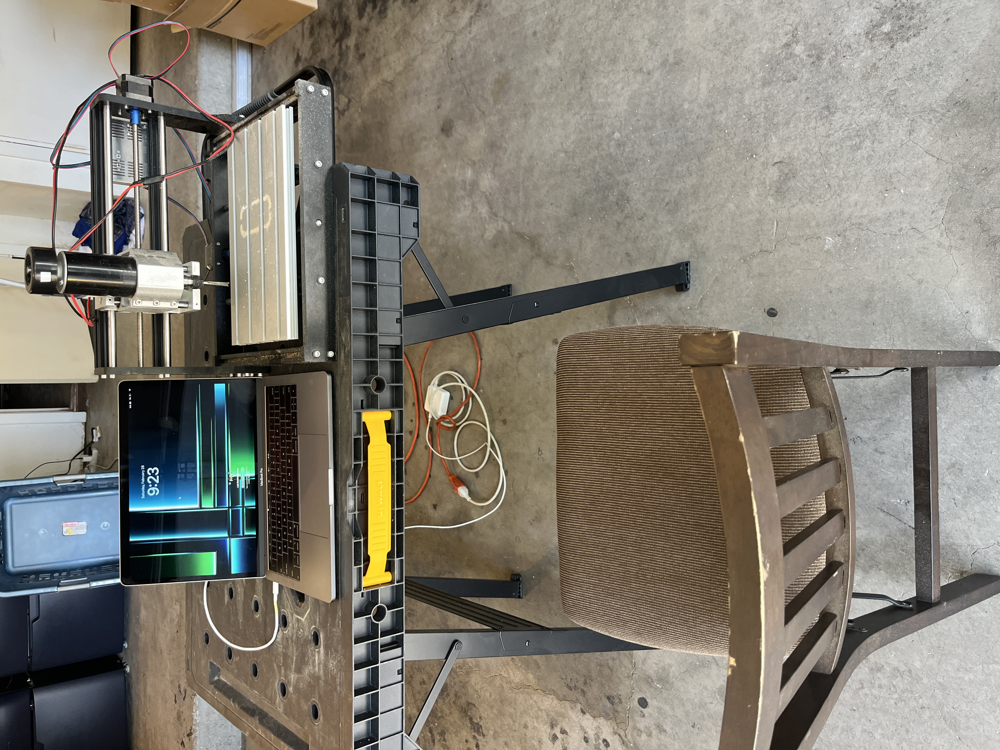
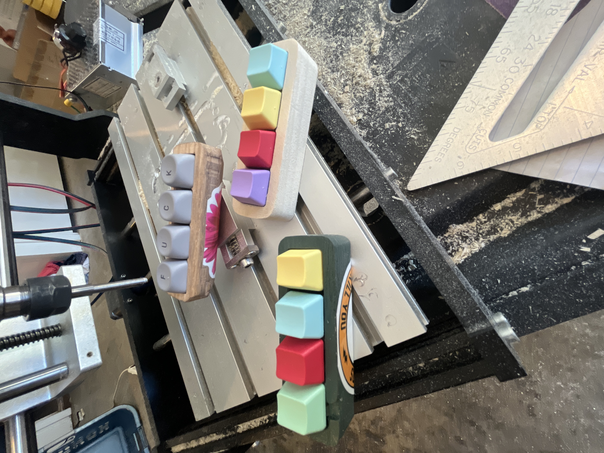
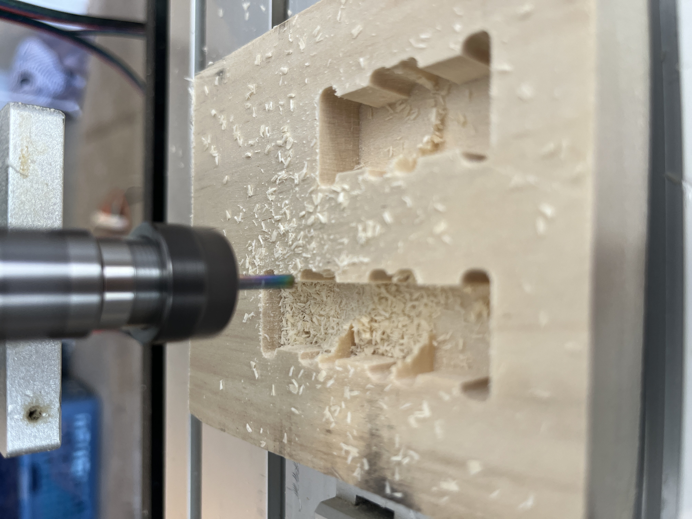

# Fidget Clicker

## Purpose
A hands-on project to experience the full product development cycle — from initial concept through design, iteration, and final manufactured product.

## Challenges
Learning CAM software from scratch was the steepest part of the process — translating a design into machine-ready toolpaths required understanding both the software and the manufacturing constraints at the same time.

## Photos

## Purchase

[Final Product](https://www.etsy.com/listing/4497052829/clicker-fidget-toy-fun-desk-accessory)
